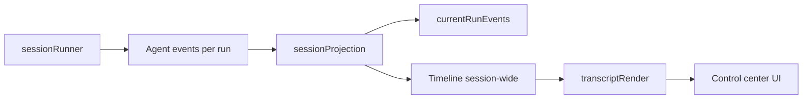

# Actuate domain glossary

Terms used across the agent loop, settings UI, and docs. Prefer these words in ADRs and architecture discussion. Code layout conventions live in `.ai/shape.md`.

## How state flows

The chat UI never owns a second copy of run history. It reads **projection** output and shapes it for display.

## Agent run

A single user task from prompt submit through terminal events (`task.completed` or `task.failed`). One run has a `taskId`. The in-memory **timeline** is derived from run **events**, not written independently.

Implemented in `useAgentSession.ts` → `sessionRunner.ts` → `liveAgentSession.ts` or `demoAgentSession.ts`.

## Agent event

Append-only record emitted during a run: `task.created`, `tool.started`, `assistant.text.delta`, `permission.requested`, and so on. Defined in `src/agent/types.ts`.

Each run emits its own event stream. Events are folded into **projection** and appended to **session logs** on disk (desktop). They are not a second in-memory session log.

## Current-run events

`AgentSessionProjection.currentRunEvents` holds only the active run’s events. `beginAgentRun` clears this buffer while **timeline** keeps prior turns. Use timeline (or disk logs) for session-wide history; use `currentRunEvents` for run-local state such as in-flight UI automation depth.

## Timeline

UI-facing chat rows derived from events: `user`, `assistant` (streaming or complete), and `activity` blocks. Built in `sessionProjection.ts` with streaming helpers in `streamingAssembly.ts`.

Do not confuse timeline items with **transcript render items** — the latter group assistant text and activity into display turns.

## Projection

Pure fold of the current run’s events (plus run status) into a session-wide **timeline**, capabilities, pending permission, and failure message. Types: `AgentSessionProjection`, `AgentSessionCapabilities` in `sessionProjection.ts`.

**Reset session** clears projection state in memory (timeline and `currentRunEvents`); it does not delete JSONL **session logs**.

## Transcript render

Display layer on top of the timeline. `buildTranscriptRenderItems` in `transcriptRender.ts` merges consecutive assistant rows and interleaved activity into **assistant-turn** items for `AgentChatTranscript`.

## Capabilities

Derived flags exposed to the UI, e.g. `canStartRun`, `canRegenerateAssistant`, `hasConversation`. Computed inside `sessionProjection.ts` — feature components should not re-derive them.

## Regenerate

Drop the last assistant turn from the timeline and start a new run with the last user prompt (`trimLastAssistantTurn` + `regenerateLastAssistant` in `useAgentSession.ts`).

## Agent mode

How the session runner executes:

- **Live** (`agentMode: "live"`) — cloud model (Anthropic or OpenAI BYOK) with native tools when on desktop.
- **Demo fixture** (`agentMode: "demo"`) — offline scripted session (`demoAgentSession.ts`); no API key.

Configured in Settings; selected in `sessionRunner.ts`.

## Active API provider

Which BYOK vendor is selected for live runs: `anthropic` or `openai`. Stored as `activeApiProvider` in app settings. The **effective provider** at run time also requires a stored key (`resolveEffectiveProvider.ts`).

## Permission mode

How often the user must approve tool calls before they run (`permissionPolicy.ts` + `permissionOrchestrator.ts`):

- `ask_risky` — skip prompts for `observe` tools; prompt for other risk classes.
- `ask_all` — prompt for every gated tool (unless session- or always-approved).
- `session_low_risk` — same prompt rules as `ask_all`; label reflects that **allow for this session** remembers the **consequence risk class** for the rest of the session.

Labels: `PERMISSION_MODE_LABELS` in `toolContract.ts`.

## Permission choice

User response to a permission prompt: `allow_once`, `allow_session`, `allow_always`, or `deny`.

- `allow_session` — adds the tool’s **consequence risk class** to the in-run `sessionRiskApproved` set.
- `allow_always` — persists the tool id in settings `persistedApprovals`.

Choice labels: `PERMISSION_CHOICE_LABELS` in `toolContract.ts`.

## Consequence risk class

Blast-radius category for a tool: `observe`, `execute_local`, `ui_automation`, `mutate_workspace`. Drives permission policy. Mapped per tool in `TOOL_CONTRACT` (`toolContract.ts`).

## Tool contract

Frozen registry (`TOOL_CONTRACT`, `AGENT_TOOL_NAMES`) of model-callable tools: stable ids (`workspace.inspect`, `terminal.run`, `file.read`, …), risk class, display names, default permission copy. UI and IPC must not invent parallel tool strings.

## UI automation

Desktop-only pointer/keyboard tools (`pointer.move`, `pointer.click`, `type.text`, `key.tap`). Gated by Settings **UI automation enabled** (`uiAutomationEnabled`) before permission prompts run. When disabled, the orchestrator denies those tools without prompting.

## Workspace root

Directory scoped for `workspace.inspect`, `file.read`, and `file.write`, and default `cwd` for `terminal.run`. Null uses app defaults; the **web build** falls back to `BROWSER_SAMPLE_WORKSPACE_ROOT` unless overridden.

Path policy on desktop goes through `app_paths.rs` — do not duplicate escaping in individual commands.

## Workspace adapter

Seam for workspace file I/O: Tauri IPC on desktop, fetch against `/browser-samples` in the web build (`workspaceAdapter.ts`, `browserWorkspace.ts`).

## Native bridge

Runtime detection and IPC surface for the Tauri shell (`nativeBridge.ts`, `tauriIpc.ts`). **Web build** = Vite without Tauri: no shell, no session logs on disk, sample workspace only.

## BYOK

Bring-your-own-key: Anthropic and/or OpenAI API keys stored in the OS credential store (desktop) or browser `localStorage` (web). Never sent to an Actuate server. Secret ids in `secrets.ts`; load/save via `secretPersistence.ts`.

## Demo fixture

Offline agent script with canned steps for tours and smoke tests without cloud access (`demoAgentSession.ts`).

## Session log

JSONL (and screenshot keyframe files) under app data for debugging and retention (`sessionLogs.ts`, Rust app store). Desktop only. Distinct from the in-memory **timeline**.

Retention controlled by `retentionDays` in settings.

## Control center

Main app screen at `/`: transcript, permission prompt, task composer, window chrome (`ControlCenter.tsx`). Settings live at `/settings`.

## Permission orchestrator

Async permission lifecycle: emit `permission.requested`, wait for user choice, apply session/persisted approvals, emit `permission.resolved` (`permissionOrchestrator.ts`). UI resolves choices via `AgentSessionProvider` / `useAgentSession`.

## Session runner

Wires workspace root, secrets, permission mode, and agent mode into either the live or demo runner (`sessionRunner.ts`).
