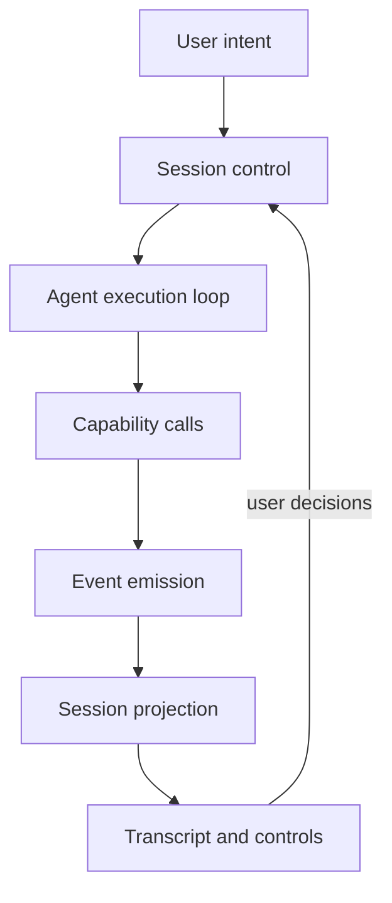

# Actuate

Self-driving software for computers. You describe a task; Actuate runs an agent that acts through gated OS capabilities and shows what happened in a transcript.

The point is tedious desktop work: files, shells, windows, UI. Privacy and local durability matter more here than bolting on another cloud integration.

Dogfoods on Windows and macOS. File / shell / clipboard / process work on both; launch / window / input / accessibility need the OS adapters plus (on macOS) Accessibility grants. Other platforms still return `unsupported_platform` for those UI seams.

## Stack

| Layer    | Choice                                                         |
| -------- | -------------------------------------------------------------- |
| Shell    | Tauri 2 (Rust), tray + global shortcut                         |
| Frontend | React 19, Vite 7, TypeScript, Tailwind 4, React Router         |
| Data     | TanStack Query; SQLite (`tauri-plugin-sql`) for chats / meters |
| Chat UI  | shadcn/ui, AI Elements, Streamdown                             |
| Agent    | Vercel AI SDK (`@ai-sdk/openai`, `@ai-sdk/anthropic`)          |
| Settings | `tauri-plugin-store`                                           |
| Secrets  | `tauri-plugin-stronghold`                                      |
| Desktop  | deep-link, updater, notifications, dialog, http                |
| Tooling  | Bun, Oxlint, Oxfmt                                             |

## How it works

Actuate is an event-driven agent session engine. The chat UI presents projected session state; it is not where tools get called.



- **Control** — start, cancel, permission pause/resume, budgets (steps / cost / wall-clock)
- **Execution** — model loop via AI SDK (`live` hits providers over `tauri-plugin-http`; `demo` replays fixtures offline)
- **Capabilities** — OS side effects with risk levels, permission gates, and (when signed in) plan/meter checks
- **Projection** — deterministic fold of events into attempt/mandate truth
- **Presentation** — home transcript, composer, status; history and settings are separate routes

Tool groups: File System, Shell (incl. launch / process), Clipboard, Window, Accessibility, Mouse, Keyboard, Shared (`wait`). Prefer accessibility over raw mouse/keyboard when an element ref exists.

Defaults: Claude Haiku 4.5, 50 steps, $5, 15 minutes, permission mode `destructive-only`, UI automation on (still platform-gated). Permission modes also include ask-every-action, ask-before-risky, and ask-once-per-class.

## Layout

```
src/app/              routes, providers, page shell, deep-link / updater bootstrap
src/features/         home chat, history, settings, account, updater UI
src/components/       shared UI primitives and AI Elements
src/lib/session/      live attempt host, events, fold/engine, control
src/lib/agent/        run loop, models, capability catalog + TS wrappers
src/lib/chats/        durable chat store (SQLite / memory)
src/lib/attempts/     durable attempt store
src/lib/mandates/     standing policy / mandate store
src/lib/settings/     store + stronghold adapters
src/lib/auth/         account session + sign-in deep link
src/lib/entitlements/ plan / meter checks
src/lib/runtime/      Tauri sniff, platform, query client
src-tauri/src/        tray, shortcuts, Rust capability commands, SQLite
src-tauri/tests/      launch / window / input / a11y / fs smoke tests
```

Import direction: `app → features → {lib, components}`. Do not import `app` from `features` / `lib` / `components`.

## Prerequisites

- [Bun](https://bun.sh)
- Stable [Rust](https://www.rust-lang.org/tools/install)
- [Tauri 2 platform deps](https://v2.tauri.app/start/prerequisites/) for your OS

### macOS

For UI automation (window / accessibility / mouse / keyboard), grant Actuate — and your terminal or IDE when running `tauri dev` / ignored smokes — under **System Settings → Privacy & Security**:

- **Accessibility** — inspect and drive UI elements; also needed for synthetic input

Usage strings live in `src-tauri/Info.plist`. App Sandbox stays off (`Entitlements.plist`) so shell, workspace files, and app launch keep working.

**Dock vs taskbar:** `tauri.conf.json` keeps `"skipTaskbar": true` for Windows (tray-style, no taskbar button). On macOS, startup overrides that with `ActivationPolicy::Regular` and `set_skip_taskbar(false)` so Actuate shows in the Dock; hide/show does not remove the Dock icon. Close still hides the window (tray remains a fast path).

Ignored live smokes (desktop + permissions required):

```bash
cargo test --manifest-path src-tauri/Cargo.toml --test launch_smoke -- --ignored --nocapture
cargo test --manifest-path src-tauri/Cargo.toml --test window_smoke -- --ignored --nocapture
cargo test --manifest-path src-tauri/Cargo.toml --test input_smoke -- --ignored --nocapture
cargo test --manifest-path src-tauri/Cargo.toml --test a11y_smoke -- --ignored --nocapture
```

Filesystem symlink roundtrip (no desktop; runs in normal CI):

```bash
cargo test --manifest-path src-tauri/Cargo.toml --test fs_smoke
```

## Run

```bash
bun install
bun run tauri dev
```

`Ctrl+Shift+A` toggles the window on Windows; `Cmd+Shift+A` on macOS. Close hides to the tray; quit from the tray menu.

In Settings: set a workspace root (file tools are scoped to it), paste Anthropic and/or OpenAI keys (Stronghold), adjust permission mode / budgets / model. Sign in under Settings → Account via the browser deep link when you want plan-backed entitlements.

Optional Vite env (see `src/vite-env.d.ts`): `VITE_ACTUATE_API_URL`, `VITE_ACTUATE_WEB_URL`, `VITE_ACTUATE_UPDATER`.

| Command             | Purpose                       |
| ------------------- | ----------------------------- |
| `bun run tauri dev` | Desktop app                   |
| `bun run build`     | `tsc` + Vite production build |
| `bun run test`      | Frontend tests (`bun test`)   |
| `bun run lint`      | Oxlint                        |
| `bun run format`    | Oxfmt on `src`                |

## Status

Dogfoodable on Windows and macOS for file / shell / clipboard / process, plus launch / window / input / accessibility when the host reports those capability groups (and macOS TCC grants are present). Chats persist locally; account sign-in and the desktop updater are wired.

Tracked in Linear: [Actuate - self-driving computer](https://linear.app/rankjay/project/actuate-self-driving-computer-81db63acc802).
