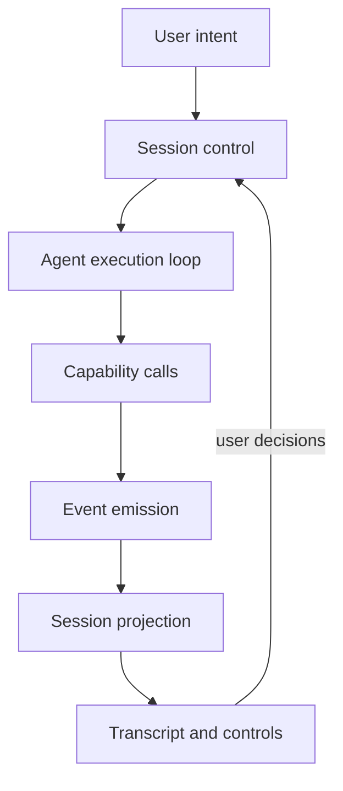

# Actuate

Self-driving software for computers. You describe a task; Actuate runs an agent that acts through gated OS capabilities and shows what happened through a transcript.

The goal is to knock out tedious desktop work so people can stay on reasoning, not clicking through the same chores. Privacy and local durability matter more here than bolting on another cloud integration.

Windows is the dogfood surface today. The stack targets macOS too, but window / accessibility / mouse / keyboard capabilities still return `unsupported_platform` off Windows.

## Stack


| Layer    | Choice                                                |
| -------- | ----------------------------------------------------- |
| Shell    | Tauri 2 (Rust), tray + global shortcut                |
| Frontend | React 19, Vite 7, TypeScript, Tailwind 4              |
| Chat UI  | shadcn/ui, AI Elements, Streamdown                    |
| Agent    | Vercel AI SDK (`@ai-sdk/openai`, `@ai-sdk/anthropic`) |
| Settings | `tauri-plugin-store`                                  |
| Secrets  | `tauri-plugin-stronghold`                             |
| Tooling  | Bun, Oxlint, Oxfmt                                    |


## How it works

Actuate is an event-driven agent session engine. The chat UI is a presentation over projected session state, not the place where tools get called.




- **Control** — start, cancel, permission pause/resume, budgets (steps / cost / wall-clock)
- **Execution** — model loop via AI SDK
- **Capabilities** — OS side effects with risk levels and permission gates
- **Projection** — deterministic fold of events into session truth
- **Presentation** — transcript, composer, status

Toolsets in the harness: File System, Shell, Clipboard, Window, OS Accessibility (UIA), Mouse, Keyboard, Shared (`wait`). Prefer accessibility over raw mouse/keyboard when an element ref exists. Screenshot is in the harness design but not implemented yet.

Defaults: Claude Haiku 4.5, 50 steps, $5, 15 minutes, permission mode `risky` (prompt on high-risk only). UI automation tools stay off until you enable them. Live mode hits providers over `tauri-plugin-http`; Demo mode replays fixtures offline.

## Layout

```
src/app/              routes and providers
src/features/         home chat, settings
src/lib/agent/        run loop, models, capability catalog + TS wrappers
src/lib/session/      events, projection, control, budgets
src/lib/settings/     store + stronghold adapters
src-tauri/src/        tray, shortcuts, Rust capability commands
src-tauri/tests/      launch / window / input / a11y smoke tests
```


## Prerequisites

- [Bun](https://bun.sh)
- Stable [Rust](https://www.rust-lang.org/tools/install)
- [Tauri 2 platform deps](https://v2.tauri.app/start/prerequisites/) for your OS

### macOS

For UI automation (accessibility, mouse, keyboard) once those adapters land, grant Actuate under **System Settings → Privacy & Security**:

- **Accessibility** — inspect and drive UI elements
- **Input Monitoring** — synthetic mouse and keyboard

Usage strings live in `src-tauri/Info.plist`. App Sandbox stays off (`Entitlements.plist`) so shell, workspace files, and app launch keep working.

## Run

```bash
bun install
bun run tauri dev
```

`Ctrl+Shift+A` toggles the window on Windows; `Cmd+Shift+A` on macOS. Close hides to the tray; quit from the tray menu.

In Settings: set a workspace root (file tools are scoped to it), paste Anthropic and/or OpenAI keys (Stronghold), optionally turn on UI automation.


| Command             | Purpose                       |
| ------------------- | ----------------------------- |
| `bun run tauri dev` | Desktop app                   |
| `bun run build`     | `tsc` + Vite production build |
| `bun run test`      | Frontend tests                |
| `bun run lint`      | Oxlint                        |
| `bun run format`    | Oxfmt on `src`                |


## Status

Dogfoodable on Windows for file / shell / clipboard work, and for UI automation once the toggle is on.

Still open: session persistence and History page, screenshot toolset, macOS native capability paths, discovery-then-inject tool loading (catalog is fully exposed today), voice input, remote orchestrator.

Tracked in Linear: [Actuate - self-driving computer](https://linear.app/rankjay/project/actuate-self-driving-computer-81db63acc802).